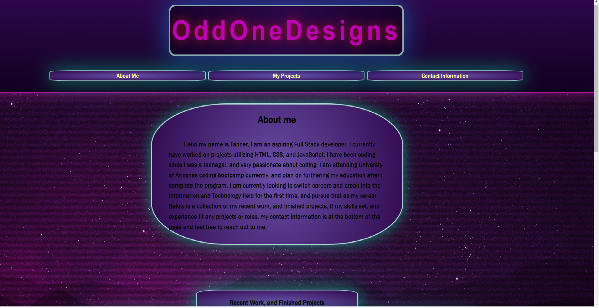

# ttieman-portfolio-

## About

    This is a portfolio that can tell you about me, how to contact 
    me, and show off some of my recent work and finished projects. 
    All of the cards are link sections to a different project
    some of these links are still open and have placeholders in them 
    ,and I will update them as I build projects in my coding career.

## Odd One Designs 
    
    This is the operating business name I have chosen for myself with the idea of making unique projects that encompass my development style and taste. I like bright colors and and synwave asthetics, and I have tried to make this page reflect me and the previous statment

 ## Function

    You can read about me in the about me section.
    You can click links at the top to be taken to the different sections on the page.
    You can Click the different project cards to be taken to the different projects I have worked on
    You can use the contact information and links to contact me directly through email, phone, or linkedin

##  Screenshot 

## Link

    [https://ttieman.github.io/ttieman-portfolio-/](doc:linking-to-pages#https://ttieman.github.io/ttieman-portfolio-/)

## License

    MIT 

## Citing Credit

    Web3 schools was used for referencing css and html element while building this page

[https://www.w3schools.com/](doc:linking-to-reference#https://www.w3schools.com/)

    DevChampoO's code on Codepen.io was the original reference for my flicker styling and getting and understanding of the use of keyframe animations secondary to that I used w3 schools for futher understanding of the syntax

[https://codepen.io/DevchamploO/pen/NBWBGq](doc:link-to-reference#https://codepen.io/DevchamploO/pen/NBWBGq)

     necolas's Normalize.css was used to start all of my intial styling from to reset the window across all broswers and make it look homogenious across all viewports across multple sizes in mobile, and desktop view

[https://necolas.github.io/normalize.css/](doc:link-to-reference#https://necolas.github.io/normalize.css/)

## Wrapping Up

 This was my first project from scratch with HTML, and Css.

 #

 I used this project to reinforce my skills that I have learned with HTML, and CSS, and to learn something new, more complex than what I am used to. I pushed myself to understand the languages syntax, structure, elements, and functions.
